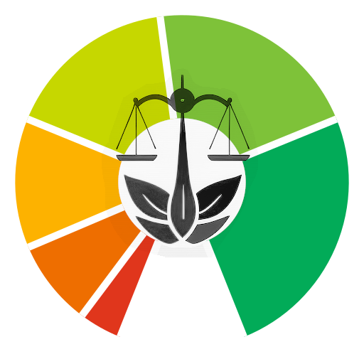

# Majority Judgment Bot for Discord



> Helps create Majority Judgment polls in Discord.


[](LICENSE.md)
[](https://github.com/MieuxVoter/majority-judgment-bot-discord-golang/releases)
[](https://github.com/MieuxVoter/majority-judgment-bot-discord-golang/actions/workflows/go.yml)
[](https://app.codecov.io/gh/MieuxVoter/majority-judgment-bot-discord-golang/)
[](https://www.codefactor.io/repository/github/mieuxvoter/majority-judgment-bot-discord-golang)
[](https://goreportcard.com/report/github.com/mieuxvoter/majority-judgment-bot-discord-golang)
[](https://discord.gg/rAAQG9S)


## Feature Wishlist

- [ ] Start a poll with `/mj create …`
- [ ] Vote on a poll using buttons
- [ ] Look at a poll's result using a button
- [ ] Use only _slash_ (`/`) commands
- [x] Be discreet : do not read messages
- [ ] Support multiple guilds
- [ ] Enforce quotas per guild
- [ ] Rerun a past poll with `/mj rerun`
- [ ] Inform about my status and metrics with `/mj info`
- [ ] Publish a poll's result using a button
- [ ] Docker Compose config (optional)
- [ ] Choose a `grading` (ex: 👍👎) per poll
- [ ] Add a `secrecy` scope to allow public ballots
- [ ] Explain how Majority Judgment works `/mj explain`
- [ ] Record feedback from users with `/mj feedback`
- [ ] Survive — [🤖🗩 Help!](https://liberapay.com/MajorityJudgmentBot/)


## Installation

This bot is in the public beta stage.  Join us on [Discord](https://discord.gg/rAAQG9S) and ask around for an invitation !


## Usage

1. Clone this repository.
2. Create `.env.local`, copied from `.env`
   ```shell
   $ cp .env .env.local
   ```
3. Configure your _discord token_ in `.env.local`
   ```shell
   $ vi .env.local
   ```
4. Run
   ```shell
   $ go run src/main.go
   ```
5. Visit the OAuth URL that was printed in the output


## Build

```shell
   $ make
   $ ./mjbot
```

> `mjbot` is about 17Mio at the moment, which is way too much.
> We use `upx` in `make release` and it shrinks to `4.5Mio` but it's still too big.


## Using docker

Configure the bot _(discord token, database, log level, etc.)_ in `.env.local`, and run `docker compose`: 

```shell
   $ cp .env .env.local
   $ vi .env.local
   $ docker compose up
```

